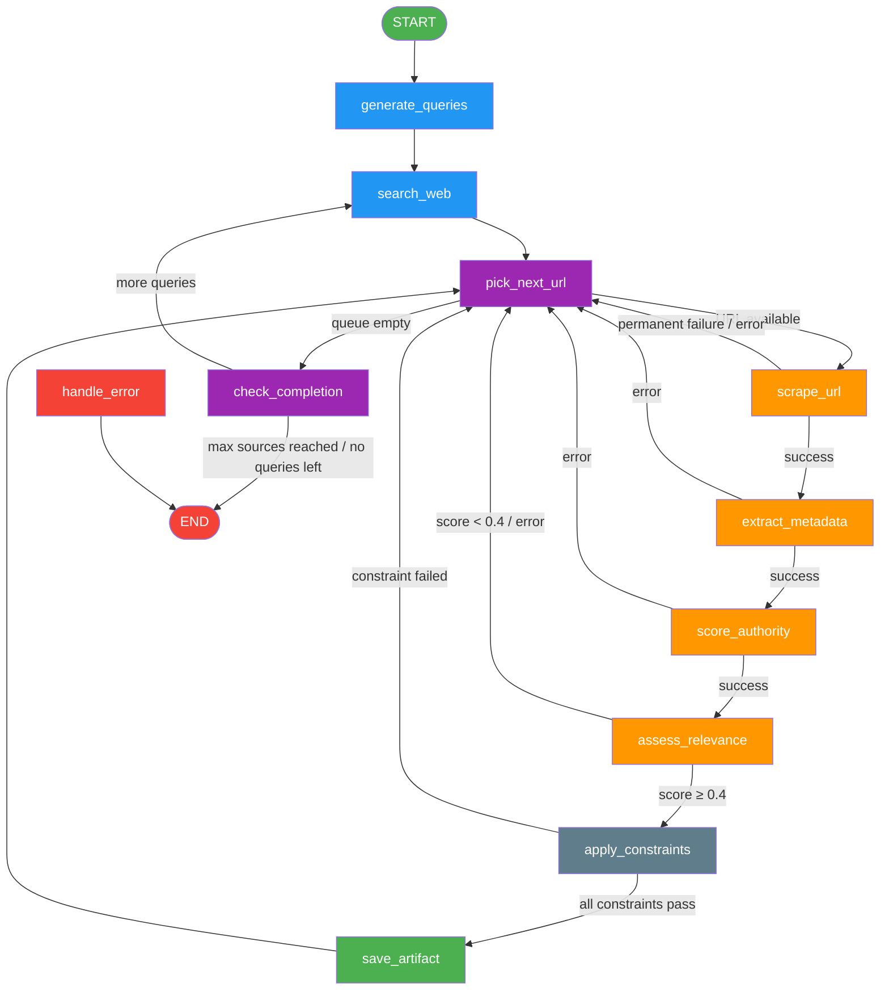
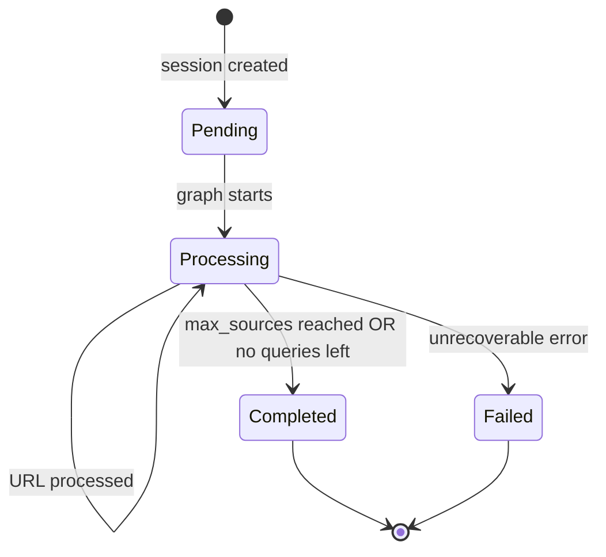
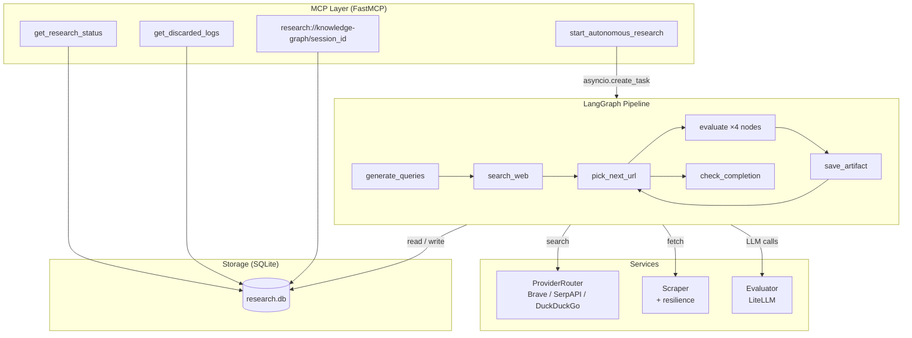

# Architecture

## Overview

Resilient Research is a **LangGraph-based pipeline** wrapped in a **FastMCP server**. A client triggers a research session via an MCP tool call; the server creates a database record, fires a background asyncio task running the LangGraph graph, and returns a `session_id` immediately. The graph runs to completion asynchronously — progress and results are always available through the status tool and the knowledge-graph resource.

---

## LangGraph Pipeline

The core processing logic is a cyclic state machine with 12 nodes. Each node is a pure async function that receives the `ResearchState` and returns a partial dict that LangGraph merges back into the state.

### Node Responsibilities

| # | Node | Responsibility |
|---|------|----------------|
| 1 | `generate_queries` | Build search query variations (deterministic templates or LLM-generated) |
| 2 | `search_web` | Execute current query through `ProviderRouter`; enqueue discovered URLs |
| 3 | `pick_next_url` | Pop next URL from the queue; reset per-URL evaluation state |
| 4 | `scrape_url` | Fetch page content; detect permanent vs. transient failures |
| 5 | `extract_metadata` | LLM: extract author, organisation, country, date, content type |
| 6 | `score_authority` | LLM: classify credibility as High / Medium / Low with numeric score |
| 7 | `assess_relevance` | LLM: score topical relevance (0–1) and extract key findings |
| 8 | `apply_constraints` | Gate: enforce min_authority, allowed_countries, min_confidence_score |
| 9 | `save_artifact` | Persist validated artifact to SQLite; deduplicate by URL |
| 10 | `log_discard` | Pass-through; discard writes happen inside upstream nodes |
| 11 | `check_completion` | Decide: end, run next search query, or wait |
| 12 | `handle_error` | Terminal: mark session failed |

### State Flow

---

## Component Architecture

---

## Architectural Decisions

### 1. LangGraph for pipeline orchestration

**Decision**: Use LangGraph's cyclic `StateGraph` rather than a simple sequential pipeline or task queue.

**Rationale**:
- The pipeline has a natural loop (process URLs → check completion → fetch more results) that maps cleanly to a cyclic graph.
- LangGraph's built-in checkpointing (`AsyncSqliteSaver`) allows interrupted sessions to be resumed without re-running completed steps.
- Each node is an isolated, testable function with no implicit dependency on execution order beyond what the graph edges express.
- Conditional edges make branching logic (discard vs. continue) explicit and easy to trace.

### 2. One file per node

**Decision**: Split the 12 nodes into individual files under `graph/nodes/` instead of a single `nodes.py`.

**Rationale**:
- Each node has a distinct responsibility and imports only the services it needs, making dependencies explicit.
- Easier to locate and modify a specific processing step without scrolling through an 500-line file.
- Reduces merge conflicts in collaborative development.
- The `nodes/__init__.py` re-exports all symbols so `builder.py` imports remain unchanged.

### 3. LiteLLM for LLM abstraction

**Decision**: Route all LLM calls through LiteLLM rather than calling provider SDKs directly.

**Rationale**:
- A single `LITELLM_MODEL` env var switches between Ollama (local), OpenAI, Anthropic, Google, etc. — no code changes required.
- Enables local-first development (Ollama) without a paid API key, and a simple promotion path to production models.

### 4. Dual query generation modes

**Decision**: Support both deterministic template-based and LLM-based query generation, controlled by `QUERY_GENERATION_MODE`.

**Rationale**:
- Deterministic mode is fast, reproducible, and requires no LLM call — ideal for testing and low-latency scenarios.
- LLM mode produces more semantically diverse queries that can surface results not reachable through fixed templates.
- Automatic fallback to deterministic if the LLM call fails keeps the pipeline robust.

### 5. Composite confidence score

**Decision**: Gate artifact persistence on a weighted composite score (`confidence_score = 0.4 × authority_score + 0.6 × relevance_score`) rather than thresholding each dimension independently.

**Rationale**:
- A highly relevant source with only medium authority should still pass, and vice versa.
- Weights are tunable via `AUTHORITY_WEIGHT` / `RELEVANCE_WEIGHT` env vars without code changes.
- The single composite number is easy to reason about in the knowledge-graph output.

### 6. Soft country constraint

**Decision**: Skip the `allowed_countries` filter when a source's country is `"Unknown"`.

**Rationale**:
- Many legitimate academic or government pages do not expose easily parseable country metadata.
- Silently discarding unknown-origin sources would produce an artificially narrow result set.
- Hard country restrictions should be implemented at a post-processing step when metadata is known to be reliable.

### 7. FastMCP for the MCP layer

**Decision**: Use FastMCP to expose tools and resources rather than implementing the MCP protocol manually.

**Rationale**:
- FastMCP handles protocol negotiation, serialisation, and transport; the application layer only defines tool functions with type-annotated signatures.
- Resources (`research://knowledge-graph/{session_id}`) give clients a standard way to subscribe to and fetch structured results without polling.
